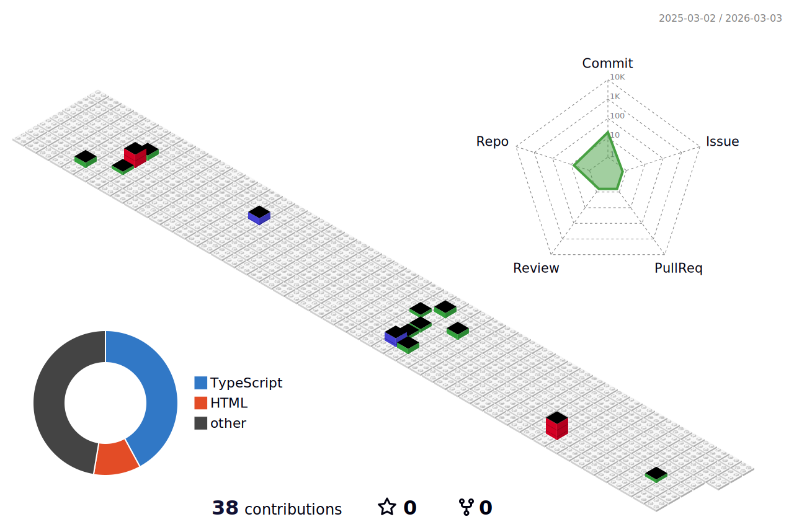

# 💫 About Me:
¡Hola! Soy un profesional en calidad de software junior con un fuerte trasfondo en infraestructura de servidores. A lo largo de mi carrera, he trabajado en optimización y gestión de sistemas, pero mi verdadera pasión es la programación. Actualmente, me encuentro en una etapa de transición, desarrollándome como programador junior y con muchas ganas de aprender, mejorar y aportar a proyectos innovadores.  Mi experiencia en infraestructura me ha brindado una visión única sobre la estabilidad y la eficiencia de los sistemas, y ahora estoy enfocando esa perspectiva en crear código de calidad, bien estructurado y escalable. Me motiva el desafío de resolver problemas complejos y aprender nuevas tecnologías. Estoy constantemente explorando nuevas herramientas, lenguajes y metodologías para estar siempre a la vanguardia.  Soy originario de Bolivia, un país lleno de oportunidades de crecimiento, y estoy comprometido en contribuir al mundo del software de una manera significativa. Me encanta trabajar en equipo, compartir conocimientos y participar en proyectos que me permitan seguir creciendo y mostrando mi potencial.  ¿Qué busco? Estoy buscando oportunidades para colaborar en proyectos que me permitan seguir creciendo y desarrollándome como programador. Tengo muchas ganas de aprender, sobresalir y dar lo mejor de mí en cada desafío. Me interesa tanto el desarrollo backend como frontend, y siempre estoy dispuesto a aprender más sobre nuevas tecnologías y metodologías que ayuden a crear soluciones eficientes y de alta calidad.  Si buscas a alguien comprometido, con una sólida ética de trabajo y pasión por la calidad en el software, ¡estoy aquí para colaborar!

## Education:

                                                                                                      
- **Master en Inteligencia Artificial, Mechine Learning y Data Science**\
2025 \
<!-- 📍 **Universidad Publica de El Alto** - El Alto, Bolivia -->

                                                                                                      
- **Master Software Libre y Estandares Abiertos**\
2013 - 2014\
<!--📍 **Universidad de Mayor de San Andres** - La Paz, Bolivia -->

                                                                                                      
- **Diplomado den Seguridad Informatica**\
2017\
<!-- 📍 **Universidad del Valle** - Cochabmaba, Bolivia -->

                                                                                                      
- **Diplomado en Open Source Software**\
2014\
<!-- 📍 **Universidad de Mayor de San Andres** - La Paz, Bolivia -->

                                                                                                      
- **Diplomado en Desarrollo en Software Libre **\
2014\
<!-- 📍 **Universidad de Mayor de San Andres** - La Paz, Bolivia -->

- **Licenciado en Informatica**\
2010\
<!-- 📍 **Universidad de Mayor de San Andres** - La Paz, Bolivia -->

## 🌐 Socials:
     

## 💻 Technical Skills

### Programming Languages: 
       
### Hosting/SaaS: 

 

### Frameworks, Plataforms: 
  

### DataBases:
   

### Other:
    

# 📊 GitHub Stats:
 
 

## Trabaja en ....

<!-- ## 🏆 GitHub Trophies
 

### ✍️ Random Dev Quote

### 🔝 Top Contributed Repo

---
 -->

<!-- Proudly created with GPRM ( https://gprm.itsvg.in ) -->
