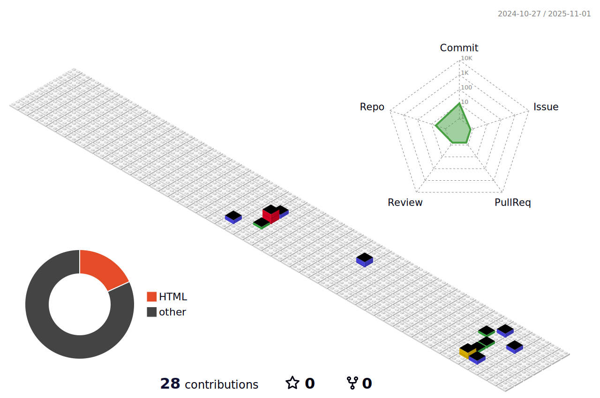

# 💫 About Me:
<!--

¡Hola! Soy un profesional en calidad de software junior con un fuerte trasfondo en infraestructura de servidores. A lo largo de mi carrera, he trabajado en optimización y gestión de sistemas, pero mi verdadera pasión es la programación. Actualmente, me encuentro en una etapa de transición, desarrollándome como programador junior y con muchas ganas de aprender, mejorar y aportar a proyectos innovadores.  Mi experiencia en infraestructura me ha brindado una visión única sobre la estabilidad y la eficiencia de los sistemas, y ahora estoy enfocando esa perspectiva en crear código de calidad, bien estructurado y escalable. Me motiva el desafío de resolver problemas complejos y aprender nuevas tecnologías. Estoy constantemente explorando nuevas herramientas, lenguajes y metodologías para estar siempre a la vanguardia.  Si buscas a alguien comprometido, con una sólida ética de trabajo, ¡estoy aquí para colaborar!

 -->

Hello! I’m a junior software quality professional with a strong background in server infrastructure. Throughout my career, I’ve worked on system optimization and management, but my true passion lies in programming. Currently, I’m in a transition phase, developing as a junior programmer with a strong desire to learn, improve, and contribute to innovative projects.
  
My experience in infrastructure has given me a unique perspective on system stability and efficiency, and now I’m focusing that viewpoint on creating quality, well-structured, and scalable code. I’m motivated by the challenge of solving complex problems and learning new technologies. I’m constantly exploring new tools, languages, and methodologies to stay at the forefront.
  
If you’re looking for someone committed with a strong work ethic, I’m here to collaborate!

## Education:

                                                                                                      
- **Master en Inteligencia Artificial, Mechine Learning y Data Science**\
2025 
<!-- 📍 **Universidad Publica de El Alto** - El Alto, Bolivia -->

                                                                                                      
- **Master Software Libre y Estandares Abiertos**\
2013 - 2014
<!--📍 **Universidad de Mayor de San Andres** - La Paz, Bolivia -->

                                                                                                      
- **Diplomado en Seguridad Informatica**\
2017
<!-- 📍 **Universidad del Valle** - Cochabmaba, Bolivia -->

                                                                                                      
- **Diplomado en Open Source Software**\
2014
<!-- 📍 **Universidad de Mayor de San Andres** - La Paz, Bolivia -->

                                                                                                      
- **Diplomado en Desarrollo en Software Libre**\
2014
<!-- 📍 **Universidad de Mayor de San Andres** - La Paz, Bolivia -->

- **Licenciado en Informatica**\
2010
<!-- 📍 **Universidad de Mayor de San Andres** - La Paz, Bolivia -->
## Work Experience:

                                                                                                      
- **Quality Assurance (QA)**\
2025 

                                                                                                      
- **Networking and Telecommunications**\
2023 - 2024

                                                                                                      
- **Data Center and Infrastructure Manager**\
2021 - 2022

                                                                                                      
- **Server Infrastructure Manager**\
2019 - 2020

                                                                                                      
- **Network and Telecommunications Manager**\
2016 - 2018

- **System Technical Support**\
2012 - 2015
## 🌐 Socials:
     

## 💻 Technical Skills

### Programming Languages: 
       
### Hosting/SaaS: 

 

### Frameworks, Plataforms: 
  

### DataBases:
   

### Other:
    

# 📊 GitHub Stats:
 
 

## Trabaja en ....

<!-- ## 🏆 GitHub Trophies
 

### ✍️ Random Dev Quote

### 🔝 Top Contributed Repo

---
 -->

<!-- Proudly created with GPRM ( https://gprm.itsvg.in ) -->
